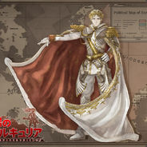

# 云母刀刀社简介

云母刀刀社是散爆网络内的Dota2爱好者内部组织的兴趣小组，于2021年7月23日成立。
社团的成立初衷，只是为了在不影响公司业务、工作排期、现实生活的前提下，和同事促进交流，业余时间能够一起愉快游戏。
目前在社团大家的努力下，刀刀社组织了两次内部联赛，并且第三届的联赛，也已经在筹备规划中了。

 
<table width="100%" border="0" cellspacing="1" cellpadding="1" align="center">
  <tr>
    <td width="33%" ><h4>第三届云母Dota2邀请赛（筹备中）</h4></td>
    <td width="33%"><h4>第二届云母Dota2邀请赛</h4></td>
    <td width="33%"><h4>第一届 云母Minor</h4></td>
  </tr>
  <tr>    
    <td align="center"></td>
    <td align="center"></td>
    <td align="center"> </td>
  </tr> 
  <tr>
    <td>Coming soon……</td>
    <td>这是云母刀刀社首次尝试模仿专业的Dota赛事的流程和规则，举办的业余赛事。通过邀请的方式，组织了社团群内的20名选手，通过roll点分配战力的方式，组织了四支队伍参赛。 从2021年11月27日起，连续的三周的周末，通过双败淘汰赛制，举办了六组比赛。2021年12月12日20点，“ElephantDotaGaming”决赛对阵“我的超哥”，最终“我的超哥”队以2：0的成绩，成功取得本次比赛的冠军，辉煌的赛绩被记录在刀刀社活动文档中。</td>
    <td>2021年9月5日19时30分，云母刀刀社第一届云母Minor赛事通过线上的方式顺利举行完毕。群内十位玩家通过roll点分配战力的方式，组成了自愿加班队和顺风就浪队。 经过紧张刺激的完整BO3赛事，自愿加班队的五位选手获得了首届赛事的胜利，辉煌的赛绩被记录在刀刀社活动文档中。</td>
  </tr>
  <tr>
    <td></td>
    <td>
    
    <a href="https://www.bilibili.com/medialist/play/1331609?from=space&business=space_series&business_id=714746">B站赛事录像播放列表</a> 
    
    <a href="https://www.youtube.com/watch?v=-kUK38RsHQo&list=PLHDmdJSAdxtxknSZcIe4EZMmhGmbZ4kOV&ab_channel=%E7%B2%89%E7%89%9B">YouTube赛事录像播放列表</a>
    </td>
    <td>
    
    <a href="https://www.bilibili.com/video/BV1Vv411P7EX">B站赛事录像地址</a> 
    
    <a href="https://www.youtube.com/watch?v=jl7DksYicIs&t=6103s&ab_channel=%E7%B2%89%E7%89%9B">YouTube赛事录像地址</a>
    </td>
  </tr>
</table>

# 现役社团选手

早期成员按ID序号升序，后续成员按照加入顺序排序

|  |  |  |  |  |
| :----------------------------------------------------------: | :----------------------------------------------------------: | :----------------------------------------------------------: | :----------------------------------------------------------: | :----------------------------------------------------------: |
|                             洋葱                             |                             钟尧                             |                             月辻                             |                             NPND                             |                             可乐                             |
|                            2卫士                             |                          5一代传奇                           |                            3中军                             |                            3中军                             |                            2卫士                             |
|  |  |  |  |  |
|                             大师                             |                             Baka                             |                             迷雾                             |                             like                             |                             冬奇                             |
|                            2卫士                             |                            4统帅                             |                            4统帅                             |                            4统帅                             |                          7超凡入圣                           |
|  |  |  |  |  |
|                            houki                             |                            老冰棍                            |                             牛牛                             |                             无尽                             |                             勺子                             |
|                            4统帅                             |                          7超凡入圣                           |                             超菜                             |                            3中军                             |                            3中军                             |
|  |  |  |  |  |
|                             十三                             |                             大古                             |                            dante                             |                             辣粉                             |                             树枝                             |
|                          5一代传奇                           |                            2卫士                             |                              无                              |                          7超凡入圣                           |                            3中军                             |
|  |  |  |                              ……                              |                                                              |
|                             帕克                             |                             潮汐                             |                            夏洛克                            |                       期待新同学加入……                       |                                                              |
|                          5一代传奇                           |                            3中军                             |                            4统帅                             |                              ……                              |                                                              |

# 社团退役选手

转会或者退役的选手信息记录在此。

||||||
|:--:|:--:|:--:|:--:|:--:|
|瘦宅|||||
|2卫士|||||

